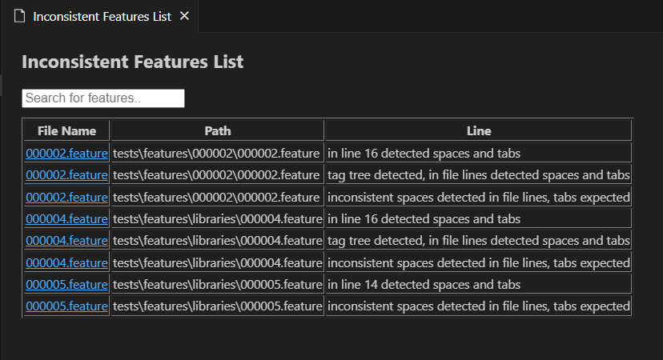
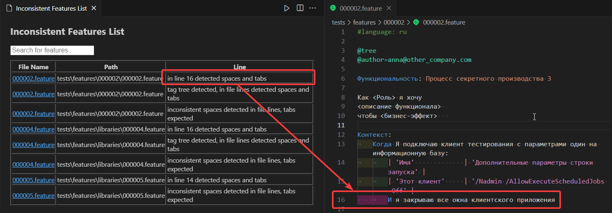
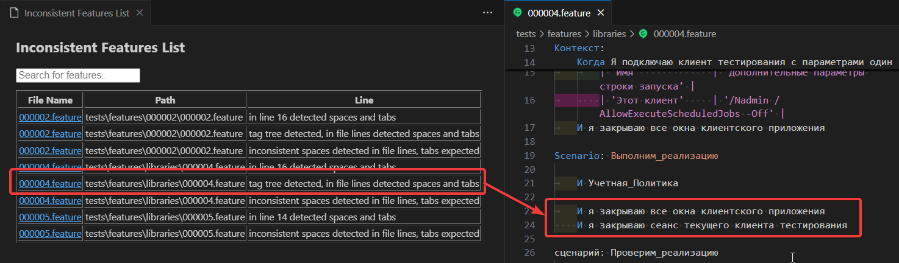
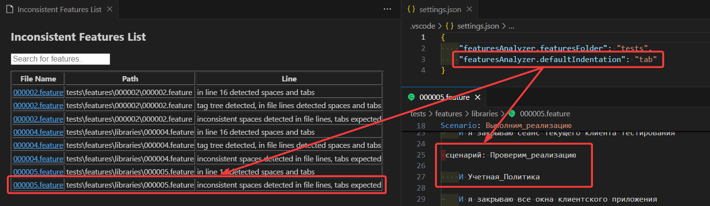
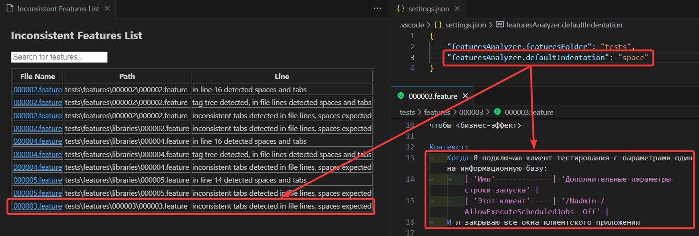

# Features Analyser

## Команды

- FeaturesAnalyzer.Create Features List. Сканирует каталог из `featuresAnalyzer.featuresFolder` и строит таблицу по данным фича-файлов.

- FeaturesAnalyser.Check Indentation. Сканирует каталог из `featuresAnalyzer.featuresFolder` и строит таблицу по некорректным отступам.

## Настройка

- featuresAnalyzer.featuresFolder. Относительный путь к каталогу для сканирования.
- featuresAnalyzer.defaultIndentation. Поддерживаемые варианты значения, кроме незаполненного: `space`, `tab`.
- featuresAnalyzer.useTagTasks. Управляет видимостью колонки 'Tasks'. В feature файле анализируется строка после тега @tasks=. Пример: @tasks=Задача 1003, Задача 805.
- featuresAnalyzer.useTagAuthor. Управляет видимостью колонки 'Author'. В feature файле анализируется строка после тега @author=. Пример: @author=John.

## Описание

### Check Indentation

- Проверяет наличие пробелов и табуляций в начальных отступах в одной строке.

- Проверяет наличие пробелов и табуляций в начальных отступах в файле при наличии тега `@tree`.

- Проверяет наличие пробелов в начальных отступах в файле при значении `tab` настройки `featuresAnalyzer.defaultIndentation`.

- Проверяет наличие табуляции в начальных отступах в файле при значении `space` настройки `featuresAnalyzer.defaultIndentation`.

